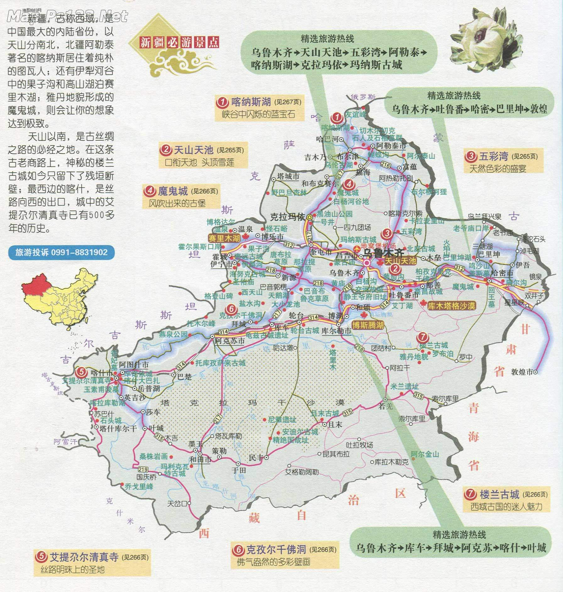

# 新疆

各区间里程数：https://img.xjlxw.com/d/file/xjxlsy/xjly/tuanduilvyou/2012/01/01/2c4b1d521f901cce2b04d62fc56ec505.jpg

景区全景图： https://img.xjlxw.com/d/file/fu/lvyouditu/lydt/8e58e786d471756f154807fb2a5353c1.jpg

​						  http://m.onegreen.net/maps/HTML/55885.html

​						 http://m.onegreen.net/jingdianditu/HTML/61303.html

交通图：https://img.xjlxw.com/d/file/fu/lvyouditu/lydt/8ffc0ae5e1cc12667834e396f9144d69.jpg

# 行程如下： 

北疆大环游 在新疆7天 赏雪山，湖泊，森林，大草原，戈壁，沙漠，

D1 ：出发→乌鲁木齐 （有3.5个小时的飞机）

D2： 乌鲁木齐→可可托海→北屯/富蕴（550/730KM） 

D3 ：北屯/富蕴→禾木/贾登峪->喀纳斯-五彩滩（这三个地方是挨着的300KM，很近，花一天时间在喀纳斯5A）

D4： 喀纳斯-五彩滩→布尔津/哈巴河 ->魔鬼城->克拉玛依 (魔鬼城是路过，400KM，这些地方主要是看看拍照)

D5 ：克拉玛依→赛里木湖→薰衣草(500KM， 主要住在赛里木湖的蒙古包里 看日落和日出，早上环湖)

D6 ：赛里木湖→伊宁→那拉提(600KM)

D7 ：那拉提->巴音布鲁克→独库公路(北段)→奎屯 (250KM)

D8 ：奎屯→天山天池→乌鲁木齐(400KM) 

D9： 乌鲁木齐→回家

总结：初步计划出来行程比较赶 而且加上坐飞机的时间

关于处理问题：新疆大部分地方都是有网的，个别很偏的公路除外

这个路线主要偏北疆、没有去沙漠、没有特克斯、没有独库的南段；一般在路途中会根据当时的实际情况对路线做部分调整，比如说天气不好的时候就没必要去草原了，就会跳过一下地方。
机票和租车：需要行程确定了在开始准备预定

## **景点建议：**（https://zhuanlan.zhihu.com/p/377801244）

**1、**新疆分为南疆和北疆，北疆以自然风光为主，南疆以人文风情为主。

**2、**北疆适合6-9月去玩，南疆适合8-10月去游玩。

**3、**3月份来主要就是看杏花，其他地方的雪都还没有化。

**4、**可可托海有山有水，冬天的时候最美，特别适合徒步的伙伴

**5、**赛里木湖大西洋的最后一滴眼泪，一个纯净如初恋的湖泊。

**6、**中国最大的沙漠在南疆，塔克拉玛干沙漠，维吾尔语意是“进去出不来的地方”。

**7、**特克斯是世界上最大最完整的八卦城，也是唯一个没有红绿灯的县城。

**8、**禾木村是一个世外桃源的存在，特别是早晨的晨雾配上金黄的树叶，简直就是美炸了。

**9、**喀纳斯在秋季的时候是最美的，简直就是承包了新疆90%的美貌。

**10、**独库公路开放时间是6月-10月才开放,，开放时间也是根据天气与情况来定的。

## **衣着建议：**

**11、**新疆的早晚温差是很大的（主要是在赛里木湖晚上很冷，其他地方都还好），厚衣服和夏天的衣服都是要带的，衣服要带够、路上没法洗；最好带一次性的袜子和内裤、很方便。

**12、**在新疆夏季的紫外线很强，一定要注意防晒，尽量穿长袖，避免皮肤直接暴晒在阳光下。

**13、**因为新疆天气干燥，最好不要佩戴隐形眼镜。

**14、**准备好充足的补水保湿的护肤品。

**15、**新疆地域辽阔，坐车的时间较长，有时不得已的情况要下车走路，所一双舒适的运动鞋尤其的重要。

**16、**晕车的伙伴一定要带上晕车药，因为行程较长气候差别过大。

## **饮食建议：**

**17、**在清真餐馆里吃饭时，不能吃非清真的食物，不能喝酒抽烟，不可高声喧哗。

**18、**新疆是水果之乡，吃水果是一大乐事，千万不要在吃完水果喝热茶，容易造成腹泻。

**19、**干果是新疆最实在，最适合送亲友的特色美食了。

**20、**“大巴扎”是维吾尔的集市，不论是想品尝当地美食，还是希望淘一些民族特色好物，去巴扎肯定是没有错的。

**21、**新疆气候干燥，饮食应多注意：多喝水，适量吃肉，肉大多都是牛羊肉。

## **住宿建议：**

**22、**要注意保暖，最好能用半天时间完全静养休息，少洗澡以避免受凉感冒和消耗体力。

**23、**睡觉时可以将枕头垫高，保持睡眠充足，切忌蒙头：睡觉时室温不宜太高，室温过高易导致缺氧。这也是新疆旅游注意事项里面最应该注意的事项。

**24、**要保持心情舒畅，情绪稳定，避免激动，防止诱发高血压和高原心脏病。

**25、**不要到了地方再定住宿（除了巴音布鲁克其他地方都还好），旺季的时候，当天订住宿的话可能没有房

**26、**不要看到好看的酒店就定，图片多数精修的

**27、**新疆找住宿要多个平台对比下，节假日的时候一定要提前预定，不然都满房了

## **一些你需要知道的大小事**

**28、**在新疆游玩的时候千万要把身份证携带在身上，路过安检、住宿的时候都要用。新疆很安全，超多安检的。

**29、**新疆很大，真的很大，真的很大，真的很大，来游玩的小伙伴起码都要有10天以上的时间，不然都玩不到什么

**30、**在新疆县、乡的银行都很少，通常为邮政储蓄，最好携带适当的现金备用（微信支付走天下）。

**31、**在新疆有些地区上厕所是要钱的，有些是不支持移动支付的，所以要准备点零钱在身上（新疆路上的厕所很糟心）。

**32、**在北疆基本不用担心语言问题，在南疆可能会偶到语言障碍，可以慢慢的说，对方是可从理解的。

**33、**新疆是信仰伊斯兰教，忌吃猪肉驴肉，也一定不要在公众场合提到。

**34、**在大巴扎买东西的时候不要随意讨价还价，确定需要购买再还价，当地很忌讳。

